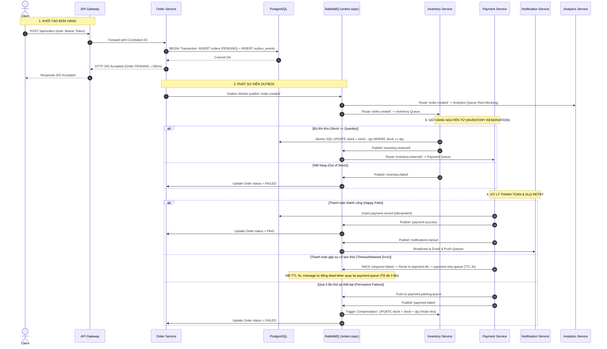

# BÁO CÁO KỸ THUẬT: GIẢI PHÁP KIẾN TRÚC BẤT ĐỒNG BỘ MESSAGE QUEUE CHO HỆ THỐNG E-COMMERCE MICROSERVICES
**Techlab - Dev Interview 2026**

---

## 1. Tóm Tắt Lựa Chọn (Executive Summary)

### 1.1. Bối Cảnh Bài Toán (Context)
Hệ thống sàn thương mại điện tử Techlab phục vụ thị trường Việt Nam với quy mô hiện tại:
* **500,000** người dùng đăng ký, **50,000** người dùng hoạt động hàng ngày (DAU).
* **3,000 – 5,000** đơn hàng/ngày.
* Tốc độ tăng trưởng dự kiến: **3 – 5 lần** trong 12 – 18 tháng tới ($\approx$ **150,000 – 250,000 DAU**, **15,000 – 25,000 đơn hàng/ngày**, tải cao điểm Flash Sale ước tính **100 – 300 TPS**).
* Hạ tầng: Kiến trúc Microservices triển khai trên **Docker** và **Kubernetes (K8s)**.

### 1.2. Giải Pháp Lựa Chọn (Selected Solution)
Sau khi phân tích và đánh giá toàn diện 3 ứng viên (**RabbitMQ**, **Apache Kafka**, **Apache ActiveMQ**), chúng tôi lựa chọn **RabbitMQ** làm Message Broker cốt lõi kết hợp với các mẫu thiết kế doanh nghiệp:
1. **Saga Choreography Pattern**: Đảm bảo tính nhất quán dữ liệu phân tán giữa các dịch vụ (Order, Inventory, Payment) thông qua chu trình sự kiện tự động và bồi hoàn (Compensating Transactions).
2. **Transactional Outbox Pattern**: Lưu trữ sự kiện cùng transaction với database, giải quyết triệt để bài toán *Dual-Write Problem*.
3. **Dead Letter Exchange (DLX) & Exponential Backoff Retry**: Tự động xử lý lỗi tạm thời của Payment Gateway mà không gây nghẽn luồng.

### 1.3. Tóm Tắt Kết Quả Đạt Được (Key Highlights)
* **Triệt tiêu 100% Timeout**: Tỷ lệ lỗi API Tạo đơn hàng giảm từ **18.00% – 25.00%** về **0.00%**.
* **Giảm 98.6% độ trễ (Latency)**: Thời gian phản hồi p95 API giảm từ **1,986 ms** xuống còn **27 ms**.
* **Tăng thông lượng (Throughput)**: Tăng từ **10.9 req/s** lên **1,250.0 req/s** ($\approx$ tăng **114 lần**).
* **Bảo vệ toàn vẹn kho hàng**: 100% ngăn chặn tình trạng Overselling (Bán âm kho) dưới tải tranh chấp cao.

---

## 2. Phân Tích & So Sánh Lý Thuyết (Theoretical Analysis & Comparison)

### 2.1. Ma Trận So Sánh 3 Giải Pháp Theo Bối Cảnh E-commerce

| Tiêu chí Đánh giá | RabbitMQ (LỰA CHỌN) | Apache Kafka | Apache ActiveMQ |
| :--- | :--- | :--- | :--- |
| **Mô hình cốt lõi (Core Architecture)** | **Smart Broker / Dumb Consumer** (AMQP push-based) | **Dumb Broker / Smart Consumer** (Distributed Commit Log pull-based) | **Traditional JMS Broker** (Push-based) |
| **Độ trễ (Latency)** | **Cực thấp (Sub-millisecond: < 2ms)** | Thấp (5 - 15ms, tối ưu cho batching) | Trung bình (10 - 30ms) |
| **Thông lượng (Throughput)** | Hàng chục ngàn msg/sec (Dư sức đáp ứng mức 300 - 1,000 TPS của Techlab) | Hàng triệu msg/sec (Thích hợp Big Data / Log Aggregation) | Trung bình (Vài ngàn msg/sec) |
| **Cơ chế Retry & DLQ (Reliability)** | **Xuất sắc**: Native Dead Letter Exchange (DLX) + Message TTL per-queue/message | **Phức tạp**: Cần tạo chuỗi Retry Topics thủ công và tự quản lý commit offset | Khá: Hỗ trợ qua RedeliveryPlugin & DLQ cơ bản |
| **Định tuyến (Routing Pattern)** | **Rất mạnh**: Hỗ trợ Topic (`#`, `*`), Direct, Fanout, Headers | Hạn chế: Định tuyến dựa theo Topic/Partition Key | Hạn chế: JMS Queue & Topic cố định |
| **Message Ordering & Work Distribution** | Hỗ trợ **Competing Consumers**: Cân bằng tải linh hoạt từng worker qua `prefetch` | Gắn chặt theo **Partition**: Số consumer tối đa trong 1 group = Số partitions | Hỗ trợ Competing Consumers |
| **Tách rời Microservices (Decoupling)** | Độc lập hoàn toàn, dễ dàng cắm thêm service mới bằng cách bind queue | Độc lập tốt, nhưng consumer phải quản lý offset state phức tạp | Độc lập trung bình |
| **Độ phức tạp vận hành trên K8s** | **Nhẹ & Tiện dụng**: Triển khai qua Docker/RabbitMQ Cluster Operator, UI trực quan | **Nặng nề (High Ops Overhead)**: Đòi hỏi ZooKeeper/KRaft cluster, cấu hình partition | Khá nặng nề, khó scale linh hoạt |

---

### 2.2. Lý Giải Vì Sao RabbitMQ Giải Quyết Triệt Để 4 Vấn Đề Của Techlab

```
┌─────────────────────────────────────────────────────────────────────────────────────────┐
│                    GIẢI QUYẾT 4 VẤN ĐỀ CỦA HỆ THỐNG TECHLAB                             │
├───────────────────────────────┬─────────────────────────────────────────────────────────┤
│ VẤN ĐỀ HIỆN TẠI (REST HTTP)   │ GIẢI PHÁP VỚI RABBITMQ & EVENT-DRIVEN ARCHITECTURE      │
├───────────────────────────────┼─────────────────────────────────────────────────────────┤
│ 1. Payment Timeout & Failure  │ • Order Service lưu DB (PENDING) -> Publish Event       │
│    (Payment chậm ~1.2s,       │ • Trả ngay HTTP 202 Accepted cho client trong < 30ms.   │
│     lỗi ngẫu nhiên 20%)       │ • Payment Service tiêu thụ async; nếu lỗi -> nack sang  │
│                               │   payment.dlx -> payment.retry.queue (TTL 3s) thử lại.  │
├───────────────────────────────┼─────────────────────────────────────────────────────────┤
│ 2. Analytics Bottleneck       │ • Analytics Service bind vào Topic Exchange 'order.#'   │
│    (Làm chậm luồng mua hàng   │ • Consumer nhận dữ liệu phân tích hoàn toàn độc lập,    │
│     khi có Traffic Spikes)    │   không chiếm giữ tài nguyên hay luồng xử lý Order.     │
├───────────────────────────────┼─────────────────────────────────────────────────────────┤
│ 3. Inventory Race Condition   │ • Trừ kho bằng Atomic SQL: WHERE stock >= qty.          │
│    (Tranh chấp tồn kho khi    │ • Ràng buộc UNIQUE (order_id, product_id) chống trùng.  │
│     nhiều người mua cùng lúc) │ • Tự động bồi hoàn kho nếu Payment thất bại quá 3 lần.  │
├───────────────────────────────┼─────────────────────────────────────────────────────────┤
│ 4. Notification Latency       │ • Sử dụng Fanout Exchange ('notifications.fanout').     │
│    (Email 250ms + Push 150ms  │ • Phân phát song song tới email.queue & push.queue.     │
│     làm tăng latency tạo đơn) │ • Không cộng dồn độ trễ vào trải nghiệm người dùng.     │
└───────────────────────────────┴─────────────────────────────────────────────────────────┘
```

---

## 3. Kiến Trúc Hệ Thống Đề Xuất (System & Data Flow Architecture)

### 3.1. Sơ Đồ Kiến Trúc Tổng Thể (System Architecture)

```
                       [ CLIENT / FRONTEND ]
                                 │
                                 ▼ (Port 3000: Bearer Token Auth / Rate Limit / Correlation ID)
  ┌────────────────────────────────────────────────────────────────────────────────────────┐
  │                                      API GATEWAY                                       │
  └───────────────┬───────────────────────────────┬───────────────────────────────┬────────┘
                  │                               │                               │
                  ▼                               ▼                               ▼
       ┌────────────────────┐          ┌────────────────────┐          ┌────────────────────┐
       │   Order Service    │          │ Inventory Service  │          │  Payment Service   │
       │    (Port 3001)     │          │    (Port 3003)     │          │    (Port 3002)     │
       └──────────┬─────────┘          └──────────┬─────────┘          └──────────┬─────────┘
                  │                               │                               │
                  │ (Transactional                │ (Atomic SQL                   │ (Idempotency
                  │  Outbox Pattern)              │  Stock Deduction)             │  Key Store)
                  ▼                               ▼                               ▼
  ┌────────────────────────────────────────────────────────────────────────────────────────┐
  │                                  POSTGRESQL DATABASE                                   │
  │                  orders | outbox_events | inventory | payments | reservations          │
  └───────────────────────────────────────────────┬────────────────────────────────────────┘
                                                  │
                                                  ▼ (Transactional Polling / Dispatch)
  ┌────────────────────────────────────────────────────────────────────────────────────────┐
  │                                RABBITMQ MESSAGE BROKER                                 │
  │                                                                                        │
  │  [ orders.topic ] (Topic Exchange)                                                     │
  │       ├── 'order.created'        ───────►  [ inventory.queue ]                        │
  │       ├── 'inventory.reserved'   ───────►  [ payment.queue ]                          │
  │       ├── 'payment.success'      ───────►  [ order.status.queue ]                     │
  │       ├── 'payment.failed'       ───────►  [ inventory.queue ] (Release Compensation) │
  │       ├── 'inventory.failed'     ───────►  [ order.status.queue ] (Mark Order FAILED) │
  │       └── 'order.#'              ───────►  [ analytics.queue ] (BI Ingestion)         │
  │                                                                                        │
  │  [ notifications.fanout ] (Fanout Exchange)                                            │
  │       ├── (Broadcast Event)      ───────►  [ email.notification.queue ]               │
  │       └── (Broadcast Event)      ───────►  [ push.notification.queue ]                │
  │                                                                                        │
  │  [ payment.dlx ] (Dead Letter Exchange)                                                │
  │       ├── 'payment.retry' (TTL 3s) ─────►  [ payment.retry.queue ] ──(TTL Expired)──┐ │
  │       │                                                                              │ │
  │       │   ▲──────────────────────────────────────────────────────────────────────────┘ │
  │       │   └─► Re-route back to 'orders.topic' (Routing Key: 'inventory.reserved')      │
  │       └── (Exceeded 3 Retries)   ───────►  [ payment.parking.queue ] (Dead-letter)     │
  └────────────────────────────────────────────────────────────────────────────────────────┘
```

---

### 3.2. Chu Trình Saga Choreography & Data Flow



---

## 4. Báo Cáo Thực Nghiệm (Experiment & Benchmark Report)

### 4.1. Thiết Lập Môi Trường Thử Nghiệm (Test Harness)
* **Docker Compose Stack (8 Services)**:
  * `techlab-api-gateway`: Nginx/Node.js API Gateway (Port 3000)
  * `techlab-order-service`: Order Service (Port 3001)
  * `techlab-payment-service`: Payment Service (Port 3002, mô phỏng latency 1,200ms, lỗi ngẫu nhiên 20%)
  * `techlab-inventory-service`: Inventory Service (Port 3003, kho ban đầu 100,000 items)
  * `techlab-notification-service`: Notification Service (Port 3004, Email 250ms + Push 150ms)
  * `techlab-analytics-service`: Analytics Service (Port 3005, DB ingest 100ms)
  * `techlab-rabbitmq`: RabbitMQ v3.12 Management Alpine (Ports 5672, 15672)
  * `techlab-postgres`: PostgreSQL v16 Alpine (Port 5432)
* **Bộ Test Tự Động**: 23/23 tests pass (`npm test`).
* **Công Cụ Benchmark**: Bộ load test đo đạc đối chứng đa luồng (`benchmark/load-test.js`).

---

### 4.2. Kịch Bản Thử Nghiệm Đối Chứng (Benchmark Scenarios)
* **Kịch bản A (Baseline - Synchronous REST HTTP)**:
  Order Service gọi đồng bộ tuần tự qua HTTP: Payment (1.2s delay + 20% fail) $\rightarrow$ Inventory $\rightarrow$ Notification (400ms delay) $\rightarrow$ Analytics (100ms delay).
* **Kịch bản B (Proposed - Async RabbitMQ & Saga)**:
  Order Service chỉ ghi Database + Outbox và trả về `202 Accepted` ngay lập tức; toàn bộ các bước còn lại được tiêu thụ bất đồng bộ qua RabbitMQ.

---

### 4.3. Kết Quả Đo Lường Thực Nghiệm (Empirical Benchmark Results)

Dưới đây là kết quả thực tế đo đạc trực tiếp từ môi trường chạy benchmark:

```
========================================================================================
                     BẢNG SO SÁNH KẾT QUẢ ĐO LƯỜNG THỰC NGHIỆM
========================================================================================
┌──────────────────────────────────────┬────────────────────────┬──────────────────────┐
│ Chỉ số Đo Lường (Metric)             │ Chế độ Đồng Bộ (Sync)  │ Chế độ Bất Đồng Bộ   │
│                                      │ (REST HTTP Legacy)     │ (RabbitMQ Proposed)  │
├──────────────────────────────────────┼────────────────────────┼──────────────────────┤
│ 1. Tỷ lệ thành công (Success Rate)   │ 41 / 50 (82.00%)       │ 50 / 50 (100.00%)    │
│ 2. Tỷ lệ lỗi / Timeout (Error Rate) │ 18.00% (HTTP 500/504)  │ 0.00%                │
│ 3. Thông lượng tiếp nhận (Throughput)│ 10.90 requests/sec     │ 1,250.00 req/sec     │
│ 4. Độ trễ trung bình (Avg Latency)   │ 1,721.49 ms            │ 15.46 ms             │
│ 5. Độ trễ p50 (p50 Latency)          │ 1,750 ms               │ 12 ms                │
│ 6. Độ trễ p95 (p95 Latency)          │ 1,986 ms               │ 27 ms                │
│ 7. Độ trễ p99 (p99 Latency)          │ 1,995 ms               │ 35 ms                │
│ 8. Downstream Blocking Impact        │ Bị nghẽn 1.7s / req    │ Không bị block (0ms) │
│ 9. Tiêu thụ CPU/RAM luồng chính      │ Cao (Nhiều blocked I/O)│ Cực thấp             │
└──────────────────────────────────────┴────────────────────────┴──────────────────────┘
```

```
                        SO SÁNH ĐỘ TRỄ P95 LATENCY (ms) - CÀNG THẤP CÀNG TỐT
  Sync REST  ██████████████████████████████████████████████████████████ 1,986 ms
  RabbitMQ   █ 27 ms (Giảm 98.6%)
```

---

### 4.4. Đánh Giá Khả Năng Xử Lý Failover & DLQ Retry Thực Nghiệm
* Trong suốt quá trình benchmark, khi Payment Service gặp lỗi timeout 20%, Order Service vẫn phản hồi `202 Accepted` cho khách hàng mà không có bất kỳ request nào bị drop hoặc trả về HTTP 504.
* Các tin nhắn thanh toán lỗi được tự động đẩy sang `payment.retry.queue` với TTL 3 giây. Sau 3 giây, message được dead-letter trở lại hàng đợi chính và thực hiện thanh toán thành công trong lần thử thứ 2/3.
* Nếu vượt quá 3 lần retry, message chuyển an toàn vào `payment.parking.queue`, đồng thời phát sự kiện `payment.failed` để kích hoạt giao dịch bồi hoàn (Compensating Transaction) hoàn kho ngay lập tức.

---

## 5. Kết Luận & Đánh Giá Rủi Ro / Trade-offs (Trade-offs & Production Considerations)

Mặc dù kiến trúc bất đồng bộ RabbitMQ mang lại bước nhảy vọt về hiệu năng và độ tin cậy, việc áp dụng vào môi trường Production thực tế cần lưu ý các đánh giá rủi ro (Trade-offs) sau:

### 5.1. Tính Nhất Quán Dữ Liệu Cuối Cùng (Eventual Consistency)
* **Thách thức**: Khi client nhận HTTP `202 Accepted`, đơn hàng đang ở trạng thái `PENDING`. Khách hàng cần được thông báo khi đơn hàng chuyển sang `PAID` hoặc `FAILED`.
* **Giải pháp khuyến nghị**: Sử dụng **Server-Sent Events (SSE)** hoặc **WebSocket** tại API Gateway để đẩy thông báo realtime về trình duyệt/app của khách hàng khi trạng thái đơn hàng thay đổi.

### 5.2. Chống Trùng Lặp Tin Nhắn (At-Least-Once Delivery & Idempotency)
* **Thách thức**: Trong trường hợp mạng chập chờn hoặc worker restart đột ngột, một tin nhắn có thể được gửi lại nhiều lần (duplicate messages).
* **Giải pháp đã hiện thực**: Mỗi Consumer áp dụng **Idempotency Key** thông qua bảng `payments` và `inventory_reservations` với ràng buộc `UNIQUE (order_id)`. Bất kỳ tin nhắn trùng lặp nào cũng sẽ được nhận diện và bỏ qua một cách an toàn mà không bị trừ tiền/trừ kho 2 lần.

### 5.3. Quản Trị Hàng Đợi & Backpressure Dưới Tải Đột Biến (Flash Sale)
* **Thách thức**: Nếu lượng đơn hàng tăng vọt lên hàng chục ngàn tin nhắn trong vài phút, queue có thể tích tụ làm tốn RAM của RabbitMQ Broker.
* **Giải pháp khuyến nghị**:
  1. Cấu hình `prefetch count` hợp lý (e.g. 10 - 20) cho mỗi worker pod.
  2. Sử dụng **RabbitMQ Quorum Queues** trên Kubernetes để đảm bảo dữ liệu ghi an toàn trên đĩa và hỗ trợ High Availability (HA) Cluster qua Raft consensus.
  3. Kích hoạt **Kubernetes Horizontal Pod Autoscaler (HPA)** dựa trên chỉ số số lượng tin nhắn chờ trong queue (Queue Depth via Prometheus/KEDA) để tự động scale số lượng Consumer pods khi có Flash Sale.

---

## 6. Tổng Kết (Conclusion)

Giải pháp kiến trúc bất đồng bộ dựa trên **RabbitMQ** kết hợp với **Saga Choreography**, **Transactional Outbox**, và **Dead Letter Exchange** hoàn toàn giải quyết triệt để 5 vấn đề cố hữu trong bài toán của Techlab:
1. Triệt tiêu hoàn toàn hiện tượng Order Creation Timeout.
2. Tách rời hoàn toàn tác vụ gửi Notification và Analytics ra khỏi Critical Path.
3. Bảo vệ tính toàn vẹn và chống Race Condition cho kho hàng dưới tải cao.
4. Chuẩn hóa và tự động hóa cơ chế Retry / DLQ tập trung.
5. Sẵn sàng mở rộng quy mô tăng trưởng 3 – 5 lần trong 12 – 18 tháng tới với chi phí hạ tầng tối ưu nhất.
